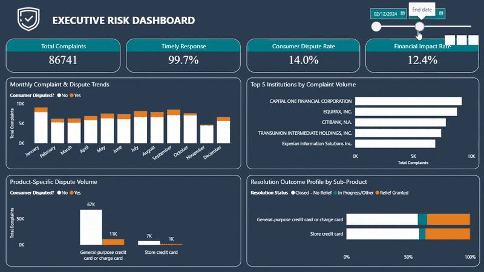

# 🌍 Consumer Risk & Operational Intelligence
**Transforming Raw Compliance Data into Actionable Insights.**

**Project Type:** Portfolio Case Study
**Tools:** SQL Server (T-SQL) / Power BI / DAX / Dimensional Modeling
**Domain:** Financial Services 

---

## 📄 Project Overview
Financial institutions face a massive volume of consumer feedback-in this case, over 86,000 credit card complaints from the CFPB database. Manually reviewing these narratives to identify regulatory risks or fraud is operationally impossible.

This project establishes an end-to-end data pipeline and intelligence system. I built a robust ELT process to ingest raw data, performed text mining via SQL to extract hidden risks, and developed a Power BI command center. The system allows stakeholders to move beyond simple volume reporting to understand *why* complaints happen, ensuring regulatory compliance and uncovering systemic product failures.

---

## 📋 Executive Summary
**The Problem:** Organizations struggle to balance speed with quality when handling consumer complaints. Standard reporting tracks volume but misses the "needle in the haystack"-critical risks like identity theft buried in unstructured text.

**The Failure of Traditional Solutions:** Most dashboards show *what* happened (Descriptive) but fail to explain *why* (Diagnostic), leading to reactive decision-making and potential regulatory fines.

**The Solution:** This project delivers a **Diagnostic and Prescriptive** solution that:
*   **Ensures Compliance:** Tracks strict 15-day regulatory response deadlines (99.7% success rate).
*   **Automates Risk Detection:** Uses SQL text mining to flag fraud without manual reading.
*   **Strategizes Operations:** Reveals that high speed does not equal high quality, identifying a 14% dispute rate despite fast processing.

---

## 🛠️ Tech Stack

*   **Database (SQL Server / T-SQL):**
    *   Used for **ELT & Data Engineering**.
    *   Utilized `BULK INSERT` for high-speed ingestion and `TRY_CAST` for robust error handling.
    *   Implemented **Text Mining** logic using SQL pattern matching to generate binary risk flags.
*   **Data Modeling (Star Schema):**
    *   Transformed flat CSVs into a **Star Schema** (Fact/Dimensions) to optimize query performance and reduce redundancy.
*   **Power BI & DAX:**
    *   Used for **Visual Intelligence & Stakeholder Reporting**.
    *   Designed with a "Dark Mode" UI for operational monitoring.
    *   Leveraged the **VertiPaq engine** via 1:* relationships for instant filtering of 86k+ records.

---

## 🔍 Business Problem

### The Challenge
*   **Volume & Noise:** 86,000+ records make manual analysis impossible.
*   **Unstructured Data:** Critical signals (fraud, identity theft) are hidden in free-text narratives.
*   **Regulatory Pressure:** Failure to respond within 15 days results in fines and reputational damage.

### The Goal
To create a scalable system that answers:
1.  **Compliance:** Are we meeting the 15-day regulatory deadline?
2.  **Root Cause:** Which specific products or states are driving fraud alerts?
3.  **Quality:** Are our "fast" responses actually resolving the customer's issue?

---

## ⚙️ Solution Architecture

1.  **Data Source:** CFPB Consumer Complaint Database (Public Data).
2.  **Ingestion Layer:** Raw CSV loaded into SQL Staging via `BULK INSERT`.
3.  **Processing Layer (SQL):**
    *   Cleaning (Standardization).
    *   Feature Engineering (Text mining for "Fraud" and "FCRA" keywords).
    *   Transformation (Modeling into Fact/Dimensions).
4.  **Analytics Layer:** Power BI Star Schema with DAX measures.
5.  **Output:** Executive Command Center Dashboard.

---

## 🧱 Data Pipeline / Methodology

### 1. Data Ingestion (ELT Strategy)
*   Loaded raw data "as-is" to preserve the source of truth.
*   Handled dirty data (e.g., commas in text fields) using `FORMAT='CSV'` and `FIELDQUOTE`.

### 2. Cleaning & Standardization
*   Created `View_Core_Cleaning` to handle data types.
*   Used `TRY_CAST` to prevent pipeline failures on bad dates.
*   Standardized `NULL` values in State/Location columns to ensure complete reporting.

### 3. Text Mining & Feature Engineering
*   **The Problem:** Text is unstructured.
*   **The Fix:** Built a keyword scanner in SQL (`CASE WHEN narrative LIKE '%identity theft%'...`).
*   **Result:** Converted text into binary flags (`1` or `0`), enabling mathematical aggregation of qualitative data.

### 4. Dimensional Modeling
*   Converted flat data into a **Star Schema**.
*   **Fact Table:** Keys and Metrics (Time to Process).
*   **Dimension Tables:** Products, Locations, Companies, Issues.
*   **Benefit:** "California" is stored once, not 10,000 times, optimizing Power BI performance.

---

## 📊 Analytics & Logic

*   **Performance Optimization (The Boolean Advantage):** Pre-calculated flags (e.g., `Is_Timely`) in SQL. This allowed DAX to run simple `COUNTROWS` operations rather than complex `FILTER` scans, drastically improving dashboard speed.
*   **SLA Tracking:** Calculated `% Timely Response` against the 15-day regulatory threshold.
*   **Risk Density:** Created a `Theft/Fraud Alert %` metric to compare risk levels across different products.
*   **Financial Impact:** Correlated `Relief Granted` (cost) against `Dispute Rate` (customer satisfaction) to measure resolution quality.

---

## 📈 Key Insights

*   **Volume $\neq$ Fault:** While Capital One has the highest volume, the next three largest sources are Credit Bureaus (Equifax, TransUnion, Experian), indicating reputational damage is often driven by third-party data reporting.
*   **The "Speed Trap":** We have a **99.7% Timely Response Rate**, yet a **14% Dispute Rate**. We are fast, but ineffective. Customers are disputing generic "Closed with explanation" responses.
*   **Geographic Anomaly:** Texas (12.3k) has more complaints than California (11k), driven almost entirely by web-based complaints. This signals a localized digital product issue.
*   **Seasonality:** A predictable post-holiday surge (Q1) exists. Staffing must be ramped up in January/February to handle volumes 20% higher than the November lull.

---

## 🧠 Business Impact

*   **Risk Mitigation:** Shifted from reactive reading to proactive monitoring. Fraud patterns are now instantly visible by product line.
*   **Operational Efficiency:** Automated the classification of "High Risk" complaints, saving thousands of analyst hours previously spent reading narratives.
*   **Strategic Shift:** The data proves that strictly chasing the "15-day deadline" KPI is hurting customer satisfaction. The business must pivot to focusing on **First Contact Resolution** to lower the 14% dispute rate.

---

## 🧪 Data Assumptions

*   **Data Source:** Publicly available data from the [CFPB Consumer Complaint Database (Credit Card complaints, last 1 year)](https://www.consumerfinance.gov/data-research/consumer-complaints/search/?dateRange=1y&date_received_max=2026-01-31&date_received_min=2025-01-31&page=1&product=Credit%20card&searchField=all&size=25&sort=created_date_desc&tab=List).
*   **Constraint:** The analysis assumes a strict 15-day internal SLA for "Timeliness" based on standard industry regulations.
*   **Scope:** Focuses heavily on the "Narrative" fields, assuming that ~41% of records containing narratives are a representative sample of the whole.

## 📂 Full Dashboard Report
View the high-resolution, 3-page PDF of the entire command center including the Executive Risk, Root Cause, and Operational modules.

## 📂 Full Technical Report

